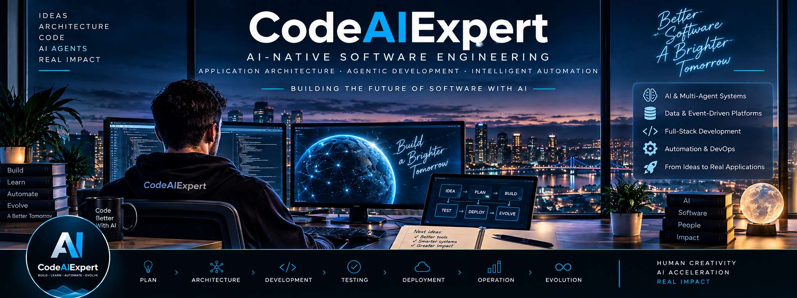

<div align="center">
  
</div>

<br>

<div align="center">

# CodeAIExpert

### AI-Native Software Engineering · Application Architecture · Agentic Development

**Building the future of software with AI.**

I design and build modern applications where **AI, software engineering, automation and architecture** work together — from the first idea to production and continuous evolution.

</div>

<br>

---

## 🧠 What CodeAIExpert Is About

**CodeAIExpert is my professional laboratory for mastering AI-native software engineering.**

I explore how professional software development changes when AI becomes part of the engineering workflow — not only as a feature inside an application, but as a collaborator across **architecture, implementation, testing, automation and software evolution**.

The goal is not to replace engineering discipline with AI. It is to combine both:

- 🤖 **AI-native development** with coding agents and intelligent workflows
- 🏗️ **Professional application architecture** built for maintainability and scale
- ⚙️ **Automation** across development, data and operations
- 🧩 **Intelligent applications** using LLMs, RAG, agents and tool integration
- 📦 **Product engineering** that turns ideas into real, working systems

<br>

## 🚀 Engineering Focus

<table>
<tr>
<td width="50%" valign="top">

### 🤖 AI-Native Development

- Coding agents & agentic workflows
- AI-assisted software lifecycle
- Codex / Claude workflows
- MCP & tool integration
- Multi-agent development
- Human + AI engineering collaboration

</td>
<td width="50%" valign="top">

### 🧠 Intelligent Applications

- LLM-powered applications
- Retrieval-Augmented Generation (RAG)
- Multi-agent systems
- Knowledge systems
- AI automation
- Deterministic logic + AI where it adds value

</td>
</tr>
<tr>
<td width="50%" valign="top">

### 🏗️ Software Architecture

- Backend & full-stack systems
- REST APIs & service boundaries
- Event-driven architectures
- Data pipelines & integrations
- Distributed systems
- Maintainable, testable application design

</td>
<td width="50%" valign="top">

### 🔄 Application Lifecycle

- Architecture & technical planning
- AI-assisted implementation
- Automated testing & quality gates
- CI/CD & containerized environments
- Observability & operations
- Continuous application evolution

</td>
</tr>
</table>

<br>

## 🛠️ Technology Stack

### Languages & Application Development


### Web & APIs


### AI & Agentic Systems


### Data & Messaging


### Engineering & Infrastructure


<br>

## 🔬 What I'm Exploring

```text
CodeAIExpert
│
├── AI-Native Software Engineering
│   ├── Coding Agents
│   ├── Agent Orchestration
│   ├── AI-Assisted SDLC
│   └── Human + AI Engineering
│
├── Intelligent Applications
│   ├── RAG & Knowledge Systems
│   ├── LLM Applications
│   ├── MCP & Tool Integration
│   └── Multi-Agent Systems
│
├── Modern Architecture
│   ├── APIs & Services
│   ├── Event-Driven Systems
│   ├── Data Pipelines
│   └── Containers & CI/CD
│
└── Product Engineering
    ├── Idea → Architecture
    ├── Architecture → Implementation
    ├── Implementation → Production
    └── Production → Continuous Evolution
```

<br>

## 💡 Engineering Philosophy

> **Build intelligent systems.**  
> **Automate what should be automated.**  
> **Keep critical logic deterministic.**  
> **Use AI where it creates real engineering value.**

AI is most powerful when it works alongside strong software engineering principles — clear architecture, explicit contracts, deterministic foundations, automated tests and measurable quality.

<br>

## 🧭 The Direction

The software engineering profession is changing.

Coding agents, LLMs and intelligent tools are becoming part of how applications are **designed, built, tested, operated and evolved**.

**CodeAIExpert is where I build, experiment and document that transition through real software.**

My focus is simple:

<div align="center">

### Build better software with AI — without giving up engineering discipline.

</div>
